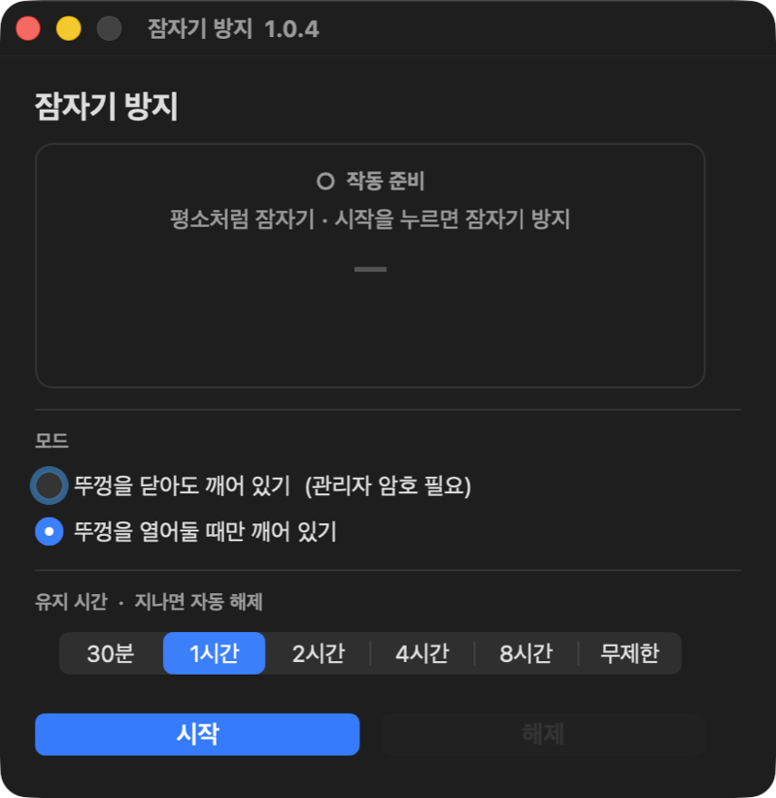
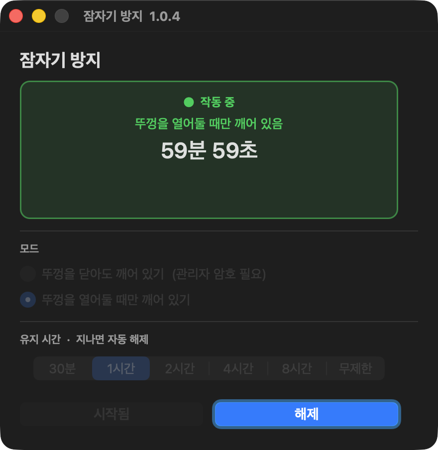

# 잠자기 방지 (lidguard)

macOS용 **잠자기 방지** 미니 앱.  
뚜껑을 닫아도 깨어 있게 하거나, 뚜껑을 연 상태에서만 절전을 막는 타이머 UI를 제공합니다.


## 화면 미리보기

<p align="center">
  
</p>

<p align="center"><b>작동 준비</b> — 모드·유지 시간을 고른 뒤 <b>시작</b></p>

<p align="center">
  
</p>

<p align="center"><b>작동 중</b> — <code>시작됨</code>은 어둡게 잠금, <b>해제</b>만 활성 · 남은 시간 표시</p>

| 상태 | 시작 버튼 | 해제 버튼 |
|------|-----------|-----------|
| 작동 준비 | 활성 (파란 강조) | 비활성 (어두움) |
| 작동 중 | **시작됨** · 비활성 · 어두움 | **활성** · 눌러서 종료 |

## 왜 쓰나요?

- 외장 모니터 + 뚜껑 닫고 작업할 때 Mac이 잠들지 않게
- 다운로드·인코딩·SSH 등 **일정 시간만** 깨어 있게
- `caffeinate` / `pmset` 을 터미널에서 외울 필요 없이 버튼으로

## 모드

| 모드 | 동작 | 권한 |
|------|------|------|
| **뚜껑을 닫아도 깨어 있기** | `pmset -a disablesleep 1` | 관리자 암호 1회 |
| **뚜껑을 열어둘 때만 깨어 있기** | `caffeinate -i` | 일반 사용자 |

유지 시간: **30분 / 1시간 / 2시간 / 4시간 / 8시간 / 무제한**  
시간이 끝나면 자동 해제(무제한은 **해제** 버튼 필요).

## 요구 사항

- macOS 12 Monterey 이상
- Apple Silicon 또는 Intel (빌드 시 선택)
- 뚜껑 닫고 깨우기 모드: 관리자 권한

## 빠른 시작

### 다운로드 (빌드 없이)

[Releases](https://github.com/truth0530/lidguard/releases) 에서 `lidguard-macOS-arm64.zip` → `잠자기방지.app` 실행  
(첫 실행: 우클릭 → 열기)

### 소스에서 빌드

```bash
git clone https://github.com/truth0530/lidguard.git
cd lidguard
chmod +x scripts/build.sh
./scripts/build.sh
open dist/잠자기방지.app
```

Universal 바이너리( arm64 + x86_64 ):

```bash
UNIVERSAL=1 ./scripts/build.sh
```

> 첫 실행 시 Gatekeeper 경고가 나오면  
> **시스템 설정 → 개인정보 보호 및 보안** 에서 허용하거나,  
> 우클릭 → 열기를 한 번 하면 됩니다.

## 사용법

1. 앱 실행
2. 모드 선택
3. 유지 시간 선택
4. **시작** — 상태 카드에 남은 시간 표시, 시작 버튼은 `시작됨`으로 잠김
5. **해제** — 즉시 평소 절전으로 복귀

## 내부 구현 (요약)

| 파일 / 경로 | 역할 |
|-------------|------|
| `/tmp/lidguard_caffeinate.pid` | `caffeinate` PID |
| `/tmp/lidguard_until` | 종료 시각(unix epoch) |
| `/tmp/lidguard_gen` | 타이머 세대(중복 해제 방지) |

- 뚜껑 닫힘 모드: `osascript` 로 관리자 셸에서 `pmset -a disablesleep` on/off  
- 뚜껑 열림 모드: `caffeinate -i` (`-t` 초 제한 또는 무제한)

## 프로젝트 구조

```
lidguard/
├── Sources/lidguard/main.swift
├── Info.plist
├── assets/
│   ├── AppIcon.icns
│   ├── screenshot-main.png      # 메인(작동 준비)
│   └── screenshot-running.png   # 작동 중
├── scripts/build.sh
├── LICENSE
└── README.md
```

## 주의

- `disablesleep` 은 시스템 전역 설정입니다. 사용 후 **반드시 해제**하거나 타이머를 두세요.
- 회사/관리형 Mac 에서는 `pmset` 정책이 막혀 있을 수 있습니다.
- 배터리 소모가 커질 수 있습니다.

## License

MIT © 2026 carg
